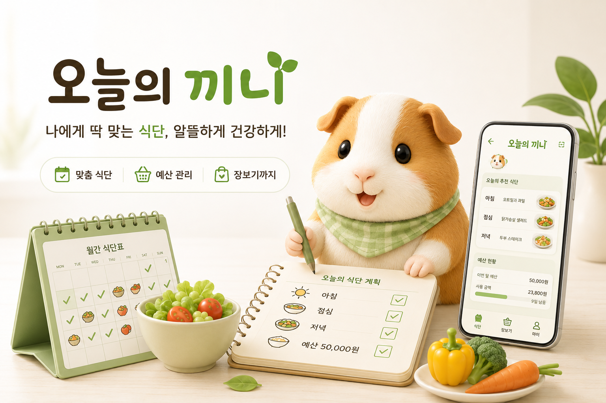
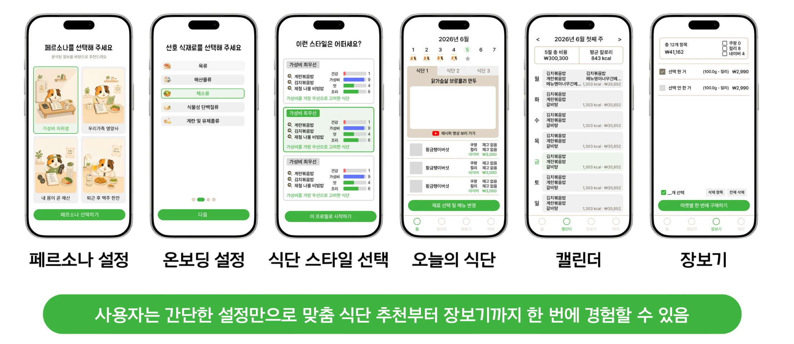
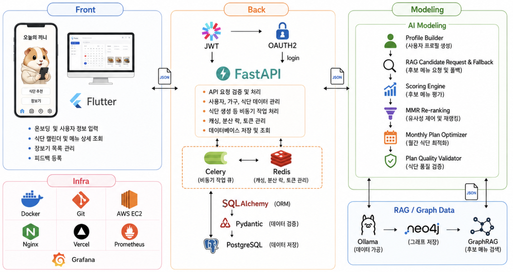
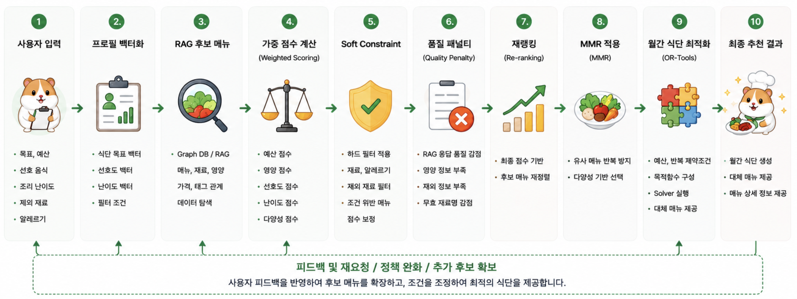

# 🐹 오늘의 끼니

<p align="center">
  
</p>

<h3 align="center">🥗 AI 기반 스마트 영양 & 식단 플래너</h3>

<p align="center">
  사용자의 <strong>식습관</strong>, <strong>예산</strong>, <strong>선호도</strong>, <strong>조리 난이도</strong>를 기반으로<br>
  개인화된 식단과 식료품 구매 정보를 제공하는 맞춤형 식단 추천 서비스입니다.
</p>

<p align="center">
  
  
  
  
  
  
</p>

<br>

## 1. 프로젝트 개요

<p align="left">
  
</p>

<table style="background-color:#FFF6C7; border-left:6px solid #E6C85C; padding:12px; width:100%;">
  <tr>
    <td>
      <strong>🎯 핵심 목표</strong><br>
      오늘의 끼니는 단순히 메뉴를 추천하는 서비스가 아니라,
      사용자 조건을 기반으로 <strong>식단 스타일 후보 → 월간 식단 → 대체 메뉴 → 식료품 구매 정보</strong>까지 연결하는 흐름을 목표로 합니다.
    </td>
  </tr>
</table>
<br>

## 2. 문제 정의

최근 식비 부담이 증가하면서 사용자는 매일 다음과 같은 고민을 하게 됩니다.

| **문제 상황** | **사용자 불편** |
|---|---|
| 🕖 메뉴 결정 | 오늘 무엇을 먹을지 결정하는 데 시간이 오래 걸림 |
| 💸 예산 관리 | 예산 안에서 식단을 구성하기 어려움 |
| 🥗 영양 고려 | 영양 균형과 선호도를 동시에 고려하기 어려움 |
| 🦐 알레르기 확인 | 알레르기나 제외 재료를 매번 직접 확인해야 함 |
| 🛒 가격 비교 | 재료 가격을 직접 비교하는 과정이 번거로움 |

본 프로젝트는 사용자가 매일 식단을 정하고 재료 가격을 비교하는 데 드는 **탐색 비용을 줄이는 것**을 핵심 목표로 합니다.

<br>

## 3. 핵심 기능

### 👤 사용자 개인화
- 사용자 맞춤 설정: 목표, 예산, 선호 음식, 조리 난이도, 제외 재료 입력
- 프로필 벡터화: 입력값을 추천 점수 계산용 조건으로 변환
- 하드 필터: 알레르기 및 제외 재료가 포함된 메뉴 제거

### 🥗 식단 추천
- 식단 스타일 후보 생성: 사용자 조건에 맞는 3일치 샘플 식단 스타일 제공
- 월간 식단 생성: 선택한 스타일을 기반으로 월간 식단 구성
- 대체 식단 추천: 각 끼니별 대체 메뉴 후보 제공

### 🧠 추천 고도화
- Weighted Scoring: 예산, 영양, 선호도, 난이도, 다양성 점수 계산
- Re-ranking / MMR: 후보 메뉴 재정렬 및 반복 메뉴 완화
- Quality Penalty: RAG 응답 품질 이슈를 추천 점수에 반영

### 🛒 장보기 연결
- 메뉴별 예상 비용 계산
- 재료 목록 및 식료품 가격 정보 연결

<br>

## 4. 서비스 흐름

<p align="left">
  
</p>

<br>

## 5. 전체 아키텍처

<p align="center">
  
</p>

### 🔗 역할 분리

| **파트** | **역할** |
|---|---|
| 📱 Frontend | 사용자 입력, 식단 스타일 선택, 월간 캘린더, 메뉴 상세, 장보기 화면 구성 |
| ⚙️ Backend | API 서버, 인증, 요청 검증, 비동기 식단 생성, DB 저장, 모델링 호출 |
| 🧠 Modeling | 사용자 프로필 변환, 추천 점수 계산, 식단 생성, 비용 계산, 난이도 계산, 재랭킹 및 다양성 제어 |
| 🕸️ RAG / Graph DB | 메뉴, 재료, 영양, 태그, 가격 관계 데이터 제공 및 후보 메뉴 검색 |

<br>

<table style="background-color:#EAF4FF; border-left:6px solid #4D96D9; padding:12px; width:100%;">
  <tr>
    <td>
      <strong>💡 구조 핵심</strong><br>
      Modeling은 Backend와 RAG 사이에서 사용자 조건을 추천 계산 구조로 변환하고,
      RAG는 후보 메뉴와 관계 데이터를 제공하는 역할로 분리됩니다.
    </td>
  </tr>
</table>

<br>

## 6. 기술 스택

<p>
  
  
  
  
  
  
</p>

### 📱 Frontend

| **기술** | **사용 목적** |
|---|---|
| Flutter | 크로스 플랫폼 모바일 앱 UI 구현 |
| Dio | Backend API 통신 |
| go_router | 화면 라우팅 |
| Riverpod | 상태 관리 |
| Figma | UI/UX 설계 및 프로토타입 제작 |

### ⚙️ Backend

| **기술** | **사용 목적** |
|---|---|
| Python 3.11 | 백엔드 개발 언어 |
| FastAPI | REST API 서버 및 Swagger 문서 제공 |
| Pydantic | 요청/응답 데이터 검증 |
| SQLAlchemy | ORM 기반 DB 작업 |
| SQLite / PostgreSQL | MVP 단계 DB 및 향후 운영 DB |
| BackgroundTasks | 식단 생성 비동기 처리 |
| JWT / HTTPBearer | 인증 및 API 요청 검증 |
|OAuth2.0 | 소셜 로그인 연동 |

### 🧠 Modeling

| **기술 / 로직** | **사용 목적** |
|---|---|
| Python | 추천 엔진 구현 |
| Pydantic | 사용자 입력 스키마 관리 |
| Weighted Scoring | 예산, 영양, 선호도, 난이도, 다양성 기반 점수 계산 |
| Soft Constraint | 선택한 식단 스타일에 따른 추가 점수 보정 |
| Quality Penalty | RAG 응답 품질 이슈를 추천 점수에 감점 반영 |
| Re-ranking | 후보 메뉴 점수 재정렬 |
| MMR | 후보 메뉴 재랭킹 및 월간 식단 다양성 제어 |

### 🕸️ RAG / Graph DB

| **기술** | **사용 목적** |
|---|---|
| 식약처 API | 식재료 및 레시피 원본 데이터 확보 |
| Ollama | 레시피 및 식재료 데이터 정제 |
| Neo4j | 메뉴-재료-영양-가격 관계 그래프 저장 |
| Scraper | 이커머스 가격 데이터 수집 |
| Batch | 가격 데이터 주기적 갱신 |
| GraphRAG | 관계 기반 후보 메뉴 검색 및 대체 식단 탐색 |

<br>

<table style="background-color:#FFF6C7; border-left:6px solid #E6C85C; padding:12px; width:100%;">
  <tr>
    <td>
      <strong>⭐ Modeling 핵심 기술</strong><br>
      Modeling 파트는 단순 점수 계산이 아니라,
      <strong>Weighted Scoring → Soft Constraint → Quality Penalty → Re-ranking → MMR 다양성 제어</strong>
      흐름으로 추천 결과를 보정합니다.
    </td>
  </tr>
</table>

<br>

## 7. 폴더 구조

```text
todays_ggini/
├── backend/
│   └── app/
│       ├── api/
│       ├── core/
│       ├── crud/
│       ├── db/
│       ├── models/
│       └── schemas/
│
├── ai/
│   └── modeling/
│       ├── services/
│       │   ├── profile/
│       │   ├── rag/
│       │   ├── recommendation/
│       │   ├── plan/
│       │   └── style/
│       └── schemas/
│
├── frontend/
│   └── today-s_kkini/
│       ├── lib/
│       └── assets/
│
├── README.md
└── .gitignore
```

### 📌 주요 디렉토리 설명

| **경로** | **설명** |
|---|---|
| `backend/app/api` | FastAPI 라우터 및 API 엔드포인트 |
| `backend/app/schemas` | Backend 요청/응답 스키마 |
| `modeling/services/profile` | 사용자 입력 기반 프로필 및 가중치 생성 |
| `modeling/services/rag` | RAG 요청/응답 매핑, 후보 메뉴 변환, 데이터 품질 검사 |
| `modeling/services/recommendation` | 추천 점수 계산, Soft Constraint, Quality Penalty 반영 |
| `modeling/services/plan` | 월간 식단 생성, 대체 메뉴 구성, MMR 기반 다양성 제어 |
| `modeling/services/style` | 식단 스타일 후보 생성 및 스타일별 가중치 관리 |
| `frontend/today-s_kkini/lib` | Flutter 앱 주요 화면, 상태 관리, API 연동 로직 |

<br>

## 8. 실행 방법

### 8-1. 저장소 클론

```bash
git clone https://github.com/레포지토리주소/todays_ggini.git
cd todays_ggini
```

### 8-2. 가상환경 생성

```bash
python3.11 -m venv .venv
source .venv/bin/activate
```

### 8-3. 의존성 설치

```bash
python -m pip install --upgrade pip
python -m pip install -r backend/requirements.txt
python -m pip install -r modeling/requirements.txt
```

### 8-4. 환경변수 설정 및 서버 실행

```bash
DATABASE_URL="sqlite:///./local.db" \
PYTHONPATH=backend:modeling \
RAG_API_URL="https://api.kkini.cloud/api/v1/meal-candidates" \
python -m uvicorn app.main:app --reload
```

### 8-5. API 문서 확인

```text
http://127.0.0.1:8000/docs
```

<br>

<table style="background-color:#EAF4FF; border-left:6px solid #4D96D9; padding:12px; width:100%;">
  <tr>
    <td>
      <strong>💡 실행 참고</strong><br>
      로컬 실행 시 <code>PYTHONPATH=backend:modeling</code> 설정이 필요합니다.
      Backend에서 Modeling 모듈을 함께 참조하기 때문에 해당 경로를 지정해야 합니다.
    </td>
  </tr>
</table>

<br>


## 9. 주요 API

| **Method** | **Endpoint** | **설명** |
|---|---|---|
| `POST` | `/api/v1/auth/google` | Google 로그인 |
| `POST` | `/api/v1/meal/modeling/style-candidates` | 식단 스타일 후보 생성 |
| `POST` | `/api/v1/meal/modeling/monthly-plan` | 월간 식단 생성 |
| `GET` | `/api/v1/meal/generate/status/{job_id}` | 비동기 식단 생성 상태 조회 |
| `POST` | `/api/v1/meal-candidates` | RAG 후보 메뉴 요청 |
<br>

## 10. 추천 로직 요약

<p align="left">
  
</p>


### 10-1. 사용자 입력 변환

| **사용자 입력** | **모델링 반영** |
|---|---|
| 월 예산 | 한 끼 예산 계산 |
| 식단 목표 | 예산, 영양, 선호도, 난이도, 다양성 가중치 설정 |
| 요리 실력 | 조리 난이도 허용 기준 설정 |
| 선호 재료 | 선호도 점수 반영 |
| 제외 재료 / 알레르기 | 하드 필터 적용 |

### 10-2. 점수 계산 항목

각 후보 메뉴는 다음 점수를 기준으로 평가됩니다.

| **점수 항목** | **의미** |
|---|---|
| `budget_score` | 한 끼 예산 대비 메뉴 비용 적합도 |
| `nutrition_score` | 사용자의 식단 목표에 대한 영양 적합도 |
| `preference_score` | 선호 카테고리 및 선호 재료군 반영도 |
| `difficulty_score` | 사용자의 조리 실력 대비 메뉴 난이도 적합도 |
| `diversity_score` | 기존 선택 메뉴와의 반복 가능성 완화 점수 |

### 10-3. 최종 점수 계산

최종 점수는 사용자 목표별 가중치, 선택한 식단 스타일, RAG 응답 품질 패널티를 반영하여 계산합니다.

```text
final_score
= base_final_score
+ style_soft_constraint_score
- total_quality_penalty
```
| **구성 요소** | **설명** |
|---|---|
| `base_final_score` | 예산, 영양, 선호도, 난이도, 다양성 점수의 가중합 |
| `style_soft_constraint_score` | 선택한 식단 스타일에 따른 추가 보정 점수 |
| `total_quality_penalty` | RAG 데이터 품질 이슈에 대한 총 감점 |

<br>

<table style="background-color:#FFF1E6; border-left:6px solid #E67E22; padding:12px; width:100%;">
  <tr>
    <td>
      <strong>⚠️ 품질 보정</strong><br>
      RAG 응답에서 영양 정보가 부족하거나 재료명이 비정상적인 경우,
      후보를 바로 제거하지 않고 <strong>품질 점수와 패널티</strong>를 적용합니다.
      이를 통해 후보 부족 문제를 완화하면서 추천 품질을 조정합니다.
    </td>
  </tr>
</table>

<br>


## 11. 협업 방식

본 프로젝트는 GitHub Pull Request 기반으로 협업합니다.

각 팀원은 기능별 브랜치에서 작업한 뒤 Pull Request를 생성하고, 리뷰 후 `develop` 브랜치로 병합합니다.

### 11-1. 브랜치 전략

```text
main
- 최종 제출 및 배포용 브랜치

develop
- 통합 개발 브랜치

feature/*
- 기능별 작업 브랜치

docs/*
- 문서 작업 브랜치
```

### 11-2. 작업 흐름

```bash
git checkout develop
git pull origin develop
git checkout -b feature/작업명
```

### 11-3. 커밋 및 푸시

```bash
git add .
git commit -m "feat: 작업 내용"
git push -u origin feature/작업명
```

### 11-4. Pull Request 흐름

| **순서** | **작업** |
|---|---|
| 1 | 기능 브랜치에서 작업 |
| 2 | 변경 사항 커밋 |
| 3 | 원격 브랜치로 Push |
| 4 | GitHub에서 Pull Request 생성 |
| 5 | 팀원 리뷰 및 수정 |
| 6 | `develop` 브랜치로 Merge |
| 7 | 작업 완료 브랜치 삭제 |

### 11-5. Commit Convention

| **타입** | **의미** | **예시** |
|---|---|---|
| `feat` | 기능 추가 | `feat: 월간 식단 생성 API 연동` |
| `fix` | 오류 수정 | `fix: RAG 응답 누락 필드 처리` |
| `docs` | 문서 수정 | `docs: README 실행 방법 추가` |
| `chore` | 설정/구조 | `chore: requirements 의존성 추가` |
| `refactor` | 코드 개선 | `refactor: 추천 점수 계산 로직 분리` |
| `data` | 데이터 | `data: 메뉴 후보 샘플 데이터 추가` |

<br>

<table style="background-color:#EAF4FF; border-left:6px solid #4D96D9; padding:12px; width:100%;">
  <tr>
    <td>
      <strong>🤝 협업 규칙</strong><br>
      모든 작업은 직접 <code>develop</code>에 반영하지 않고,
      <strong>기능 브랜치 → Pull Request → Review → Merge</strong> 흐름으로 관리합니다.
      이를 통해 각 파트의 변경 사항을 추적하고 충돌을 줄일 수 있습니다.
    </td>
  </tr>
</table>

<br>

## 12. 팀원 역할

<p align="left">
  
</p>

<br>

## 13. 주요 작업 내역

| **구분** | **작업 내용** |
|---|---|
| 🔐 인증 | Google OAuth2 로그인 API 구현 |
| ⚙️ Backend 연동 | 백엔드와 모델링 추천 엔진 직접 호출 구조 연동 |
| 🕸️ RAG 연동 | RAG Cloud API와 모델링 추천 엔진 연동 |
| ⏳ 비동기 처리 | 식단 생성 비동기 처리 및 Polling API 구현 |
| 👤 사용자 프로필 | 사용자 입력 기반 프로필 생성 및 목적별 가중치 계산 |
| 🥗 식단 스타일 | 3일치 식단 스타일 후보 생성 |
| 📅 월간 식단 | 선택한 스타일 기반 월간 식단 생성 및 대체 식단 제공 |
| 🧠 추천 고도화 | Weighted Scoring, Soft Constraint, Re-ranking, MMR 기반 추천 구조 적용 |
| 🛡️ 품질 보정 | RAG 후보 메뉴 품질 점수 및 패널티 적용 |
| 💰 비용 계산 | 재료 사용량과 가격 정보를 활용한 메뉴 예상 비용 계산 |
| 🍳 난이도 계산 | 재료 수, 조리 단계, 조리 시간 기반 조리 난이도 계산 |
| 🧂 비용 예외 처리 | 물, 소금, 후추 등 기본 재료 비용 과다 계산 방지 |
| 🧹 데이터 방어 로직 | 무효 재료명 및 누락 데이터 품질 이슈 감점 보완 |

<br>

<br>

## 14. 한계 및 향후 개선 방향

| **구분** | **현재 한계** | **개선 방향** |
|---|---|---|
| 🕸️ RAG 데이터 | 일부 메뉴의 영양 정보, 재료명, 재료군 정보가 부족할 수 있음 | RAG 원본 데이터 품질 보강 및 정제 로직 개선 |
| 🥗 영양 정보 | `calories`, `protein`, `carbohydrate`, `fat` 값이 0으로 내려오는 경우가 있음 | 영양 성분 데이터 매핑 보완 |
| 💰 가격 정보 | 일부 재료의 가격 정보가 없거나 기본 재료 비용이 과도하게 계산될 수 있음 | 실제 식료품 가격 API 연동 및 기본 재료 예외 처리 고도화 |
| 🧠 추천 로직 | 현재는 MVP 기준의 Weighted Scoring과 MMR 중심 추천 구조 | 사용자 피드백 기반 추천 가중치 자동 조정 |
| 📅 월간 식단 | 다양성 제어는 적용했지만 장기 식단 최적화는 추가 개선 필요 | 월간 배치 최적화 및 반복 메뉴 제어 튜닝 |
| 🧪 Style Validation | 선택한 스타일과 실제 생성 식단의 일치도 검증이 제한적임 | 스타일별 검증 기준 고도화 |
| ⚙️ Backend | MVP 단계에서는 SQLite와 BackgroundTasks 중심 구조 | PostgreSQL 전환 및 Celery/Redis 기반 비동기 처리 고도화 |
| 📱 Frontend | MVP 화면 중심으로 구성 | 사용자 피드백 기반 UX 개선 및 결과 화면 가독성 향상 |
| 🚀 배포 | 로컬 및 MVP 검증 중심 환경 | 운영 환경 분리, 배포 자동화, 안정성 개선 |

<br>

<table style="background-color:#FFF1E6; border-left:6px solid #E67E22; padding:12px; width:100%;">
  <tr>
    <td>
      <strong>🚧 개선 방향</strong><br>
      향후에는 <strong>RAG 데이터 품질 보강</strong>, <strong>영양 정보 정확도 개선</strong>,
      <strong>사용자 피드백 기반 추천 고도화</strong>, <strong>운영 환경 분리</strong>를 중심으로 개선합니다.
    </td>
  </tr>
</table>

<br>

<br>

## 15. 프로젝트 상태

현재 프로젝트는 **MVP 검증 단계**입니다.

이번 단계에서는 사용자가 입력한 조건을 기반으로  
**RAG 후보 메뉴 검색 → 모델링 추천 점수 계산 → 식단 스타일 후보 생성 → 월간 식단 생성 → 프론트엔드 표시**까지 이어지는 전체 흐름을 검증했습니다.

### 완료된 핵심 흐름

| 구분 | 상태 |
|---|---|
| 사용자 입력 기반 프로필 생성 | ✅ 완료 |
| Backend ↔ Modeling 연동 | ✅ 완료 |
| Modeling ↔ RAG Cloud API 연동 | ✅ 완료 |
| RAG 응답 매핑 및 품질 검사 | ✅ 완료 |
| 식단 스타일 후보 생성 | ✅ 완료 |
| 월간 식단 및 대체 메뉴 생성 | ✅ 완료 |
| 메뉴별 비용/난이도 계산 | ✅ 완료 |
| RAG 품질 패널티 적용 | ✅ 완료 |