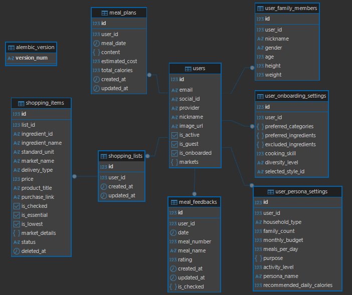

# 오늘의 끼니 (Todays-Ggini) - Backend

**사용자 맞춤형 예산 및 영양 균형 식단 추천 비동기 분산 아키텍처 시스템**

## 1. 기술 스택 (Tech Stack)

### 언어 및 핵심 Framework
* **Language:** Python (v3.13)
* **Framework:** FastAPI
* **ORM & Validation:** SQLAlchemy, Pydantic V2
* **Authentication:** OAuth2, JWT, FastAPI HTTPBearer

### 비동기 & 데이터베이스
* **Task Queue & Broker:** Celery, Redis
* **Database (RDBMS):** PostgreSQL
* **HTTP Client:** HTTPX

### DevOps & 인프라
* **Cloud Platform:** AWS EC2
* **Containerization:** Docker, Docker Compose
* **Version Control & Docs:** GitHub, Notion

## 2. 데이터베이스 ERD


* User : 사용자 로그인 및 인증 정보

* UserFamilyMembers : 사용자 가구원 관련 데이터

* UserOnboardingSetting : 사용자 온보딩 데이터

* UserPersonaSetting : 사용자 페르소나 관련 데이터

* MealPlan : 사용자 개인화 식단 정보

* Shopping List : ShoppingItem의 헤더 역할

* ShoppingItem : 장바구니에 담겨 있는 재료 데이터

* MealFeedback: 사용자 식단 피드백 데이터

## 3. 핵심 설계 및 고도화 기능

### 1) 인증 및 로그인
* **OAuth2 소셜 로그인 연동:** 카카오, 구글, 네이버 등 표준 OAuth2 방식을 연동하여 검증된 유저 정보 기반의 세션을 생성합니다.
* **Access/Refresh Token 이원화:** 기존 Access Token 단일 인증 방식에서 오는 탈취 리스크를 방어하기 위해 유효기간이 서로 다른 토큰 이원화 체계를 구축합니다.
* **Redis 블랙리스트:** 로그아웃 및 회원 탈퇴 시 해당 토큰을 파기하고 Redis 내에 블랙리스트를 생성하여 세션 하이재킹 피해를 최소화합니다.

### 2) AI 연산 결과 캐싱 및 분산 락 적용
* **식단 연산 캐싱:** 매번 무거운 AI 서버를 호출하던 방식에서 최초 연산 결과를 Redis 메모리에 캐싱하는 구조로 전환하여 식단 생성 대기 시간을 단축하고 서버 부하를 감소시킵니다.
* **Redis 분산 락 구현:** 다중 컨테이너 및 분산 환경에서 동시 요청 시 발생할 수 있는 경쟁 상태(Race Condition)를 제어하기 위해, 특정 유저의 특정 날짜 식단에 대해 단 하나의 프로세스만 접근 권한을 쥐도록 통제하는 분산 락 아키텍처를 도입하여 데이터 정합성을 확보했습니다.

### 4) LLM 기반 이미지 검색 고도화 및 캐싱
* 경량화 모델인 `GPT-4o-mini`를 채택하여 복잡한 한글 메뉴명을 최적화된 영단어로 가공하는 프롬프팅을 추가. 가공된 키워드를 `Pixabay API`에서 검색어로 활용하여 검색 정확도를 향상, 검색된 이미지는 Redis에 캐싱하여 동일 메뉴 요청 시 지연 시간 없이 즉시 반환합니다.

### 5) 전체 통신 시퀀스 및 데이터 흐름 (Data Flow)

1. **인증 및 요청 검증 (Client ↔ FastAPI):** 소셜 로그인 연동을 통해 **JWT (Access/Refresh)**를 발급하며, API 호출 시 FastAPI 의존성 주입(`Depends`) 레이어가 토큰 위변조 및 만료 여부를 실시간 검증합니다.
2. **비동기 작업 위임 (Client ↔ FastAPI ↔ Redis):** 월간 식단 생성 요청 인입 시, 웹 서버는 동기적으로 대기하지 않고 **작업 ID(`job_id`)**를 즉시 반환한 뒤 Redis 큐에 태스크를 밀어 넣어 메인 서버의 커넥션을 방어합니다.
3. **외부 서버 연동 및 파싱 (Redis ↔ Celery ↔ AI 모델링 서버):** Celery 워커가 작업을 할당받아 `HTTPX` 비동기 클라이언트로 외부 AI 모델링 서버와 통신합니다. 전용 매퍼(Mapper) 레이어를 거쳐 데이터 변환 및 외부 솔버 연산을 비동기 넌블로킹으로 처리합니다.
4. **상태 폴링 및 DB 적재 (Client ↔ FastAPI ↔ Celery ↔ AWS RDS):** 프론트엔드가 `job_id`로 작업 상태를 **Polling**하는 동안, Celery 워커는 수신한 식단 데이터를 검증하여 분리된 **AWS RDS (PostgreSQL)**에 최종 영속화합니다.

### 6) 예외 처리
* HTTP 상태에 따른 오류 처리 기준을 분리하여 각 HTTP 상태 별 메시지를 작성하여 예외 상황에서도 에러 로그 메시지가 그대로 화면에 노출되지 않도록 설정했습니다.

## 4. 핵심 API 명세서 (API Specification)

### 인증 및 로그인 (`/api/v1/auth`)
* `POST /guest/init` : 게스트 로그인 및 임시 세션 발급
* `POST /google` | `/kakao` | `/naver` : 소셜 로그인 연동
* `POST /refresh` : Refresh Token을 이용한 Access Token 재발급
* `POST /logout` : 로그아웃 (토큰 블랙리스트 강제 적재)
* `POST /unregister` : 회원 탈퇴 및 토큰 파기

### 사용자 온보딩 및 설정 (`/api/v1/user`)
* `POST /recommand-personas` : 페르소나 추천 요청
* `POST /persona-setting` : 페르소나 관련 세부 설정 수정
* `POST /onboarding-setting` : 예산/목적 등 온보딩 관련 설정 수정
* `GET /me` : 현재 로그인된 사용자 정보 조회
* `PATCH /profile` : 사용자 닉네임 변경
* `PUT /profile/image` : 프로필 이미지 변경

### 식단 관련 (`/api/v1/meal`)
* `POST /generate` : 비동기 AI 식단 생성 태스크 트리거 (Job ID 반환)
* `GET /generate/status/{job_id}` : Celery 작업 상태 Polling (`PENDING`, `PROCESSING`, `COMPLETED`, `FAILED`)
* `POST /confirm` : 식단 최종 확정 및 요약 정보 반환
* `GET /calender` : 확정된 월간 식단 캘린더 전체 조회
* `GET /{date}` : 일일 식단 상세 정보 조회
* `GET /menu/{meal_date}/{menu_id}` : 특정 메뉴의 상세 영양 성분 정보 조회
* `POST /{date}/swap` : 균형성 유지를 위한 메뉴 스왑(Swap)
* `PATCH /{date}/menu/{slot}` : 특정 슬롯의 대안 메뉴 변경 반영
* `GET /menus/{meal_id}/alternative` : 조건에 맞는 대안 메뉴 목록 후보 조회
* `POST /feedback` : 식단 만족도 및 피드백 저장
* `POST /generate_sample_3days` : 온보딩 전 체험을 위한 3일치 샘플 식단 생성 요청

### 장바구니 및 쇼핑 관련 (`/api/v1/shopping`)
* `GET /ingredients/{ingredient_id}/prices` : 연동 마켓별 상세 가격 정보 비교 조회
* `POST /add-shopping-items` : 식단 재료 화면에서 선택한 항목들을 장바구니에 추가
* `GET /shopping-list` : 유저 맞춤형 통합 장보기 목록 조회
* `PATCH /shopping-list/items/check` : 장보기 목록 내 아이템 체크 상태 업데이트 및 최신 비용 요약 반환
* `POST /shopping-list/items/batch-delete` : 선택된 장보기 항목 목록 일괄 삭제
* `GET /shopping-list/trash` : 삭제된 장보기 항목 목록 조회 (휴지통 기능)
* `POST /shopping-list/items/restore` : 휴지통 내 삭제된 항목 복원

---

## 5. 품질 검증 및 테스트 (QA)

외부망 단절 및 외부 AI 서버 장애 상황 속에서도 백엔드의 생존성을 보장하기 위해 `Pytest`와 비동기 HTTP 모킹 라이브러리인 `RESPX`를 결합하여 **4가지 예외 시나리오** 단위 테스트 파이프라인을 구축했습니다.

```bash
# 외부 API 연동 레이어 및 예외 시나리오 테스트 구동
python -m pytest -v backend/tests/test_modeling_client.py
```

### 4대 모킹 가상 시나리오
1. 정상 식단 생성 가동: 대용량 데이터 패킷 정상 가공 및 요약 데이터 추출 성공 검증

2. 인증 만료: 외부 API Key 만료/오류 발생 시 즉각적인 401 Unauthorized 전파 검증

3. Timeout: 외부망 지연 시 네트워크 소켓 자원을 보호하는 Connect/Read Timeout (504) 강제 트리거 검증

4. 악성 페이로드: 규격에 맞지 않는 데이터 인입 시 422 Unprocessable Entity 가드 가동 검증

## 6. 배포 및 운영 환경 설정 (Deployment)
본 프로젝트는 상용 클라우드 환경인 AWS EC2 (Ubuntu) 인프라 상에서 가동 중이며, 모든 프로세스는 Docker 컨테이너로 규격화되어 있습니다.

로컬에서 코드가 변경될 시 원격 저장소에 푸쉬 후 다음의 명령어를 통해 배포된 서버에 업데이트합니다.
```bash
# 1. 소스코드 원격지 동기화
git pull origin main # 혹은 동기화할 브랜치

# 2. 구형 프로세스 자원 해제 및 새 환경변수 기반 레이어 재빌드
docker compose down
docker compose up -d --build
```